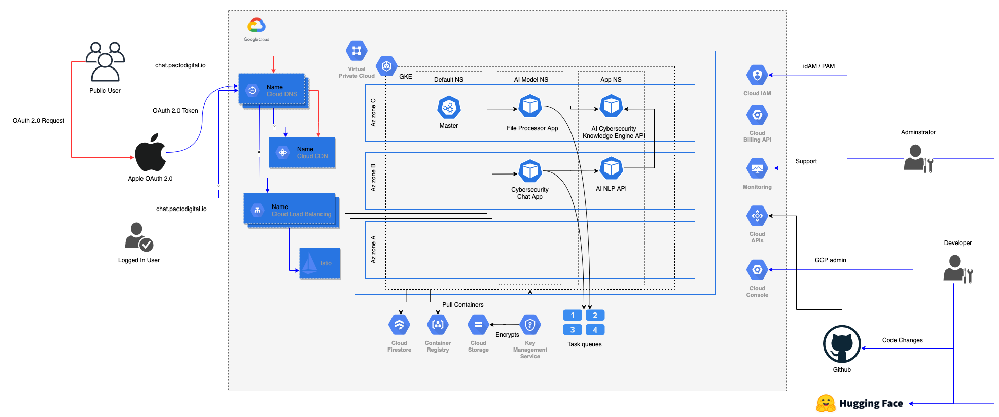
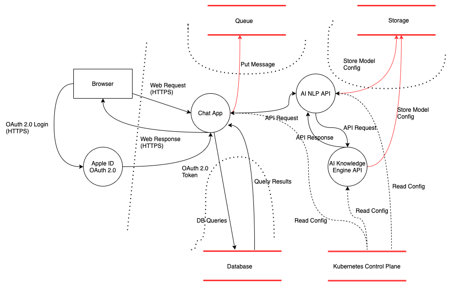

# Example Llama2 AI hosting on GKE

An example Llama3 AI project hosted on Kubernetes (GKE) on Google Cloud Platform (GCP).  There are two AI deployments of Llama 2 the AI NLP API (llama2:7b-chat) and AI Knowledge API (llama2:70b).  There are two applications one which is the chat interface and the other is a file uplaod interface for file digestion and then QA on set file.

This project is in a definition stage but the idea is to fully define a solution following Security by design principles and demonstrate threat modelling best practices using OWASP.

## REST APIs

- llama-nlp-api
- llama-knowledge-api

## Web Apps

- chat-app
- file-upload-app

## Solution Design

It is the initial draft of the infrastructure design and will be updated as IaC and Threat modelling progress.

Application design has not yet been defined.

REST API design has not yet been defined.

Data model definition is not yet full understood and defined.

## Threat Modelling

A draft definition of the OWASP Threat model and Data flow diagrams.  

**File Upload App not yet complete**
**NLP API not yet complete**
**Knowledge API not yet complete**

